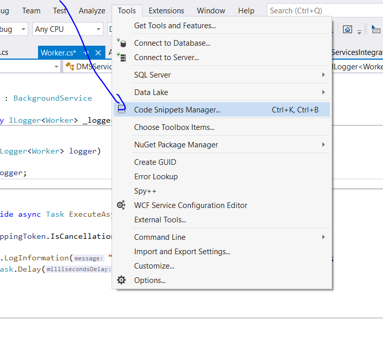
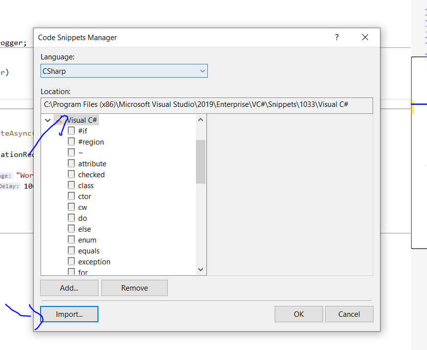

# VisualStudio-CodeSnippets
Be more productive 

## Adding the snippet
- open the tools => Code Snippets Manager or Ctrl+k+B

- import the snippet from the repository cloned to a visual studio snippets folder of C#

